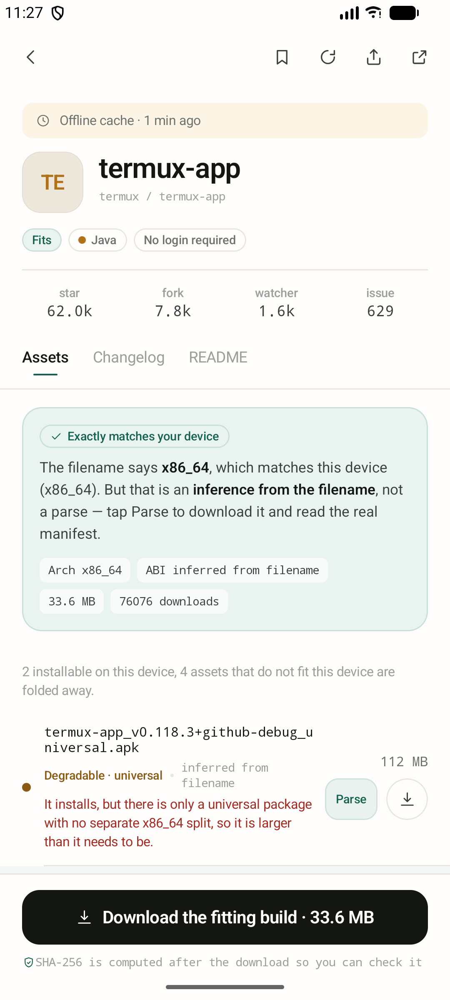
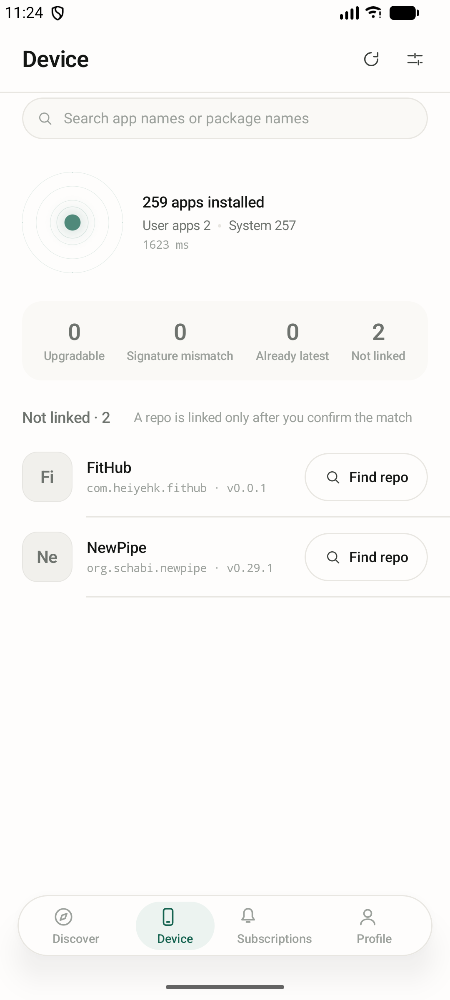
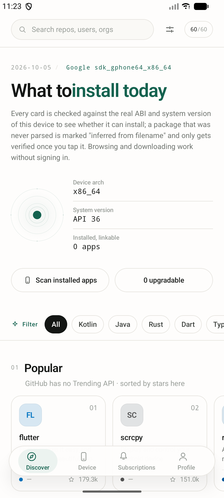
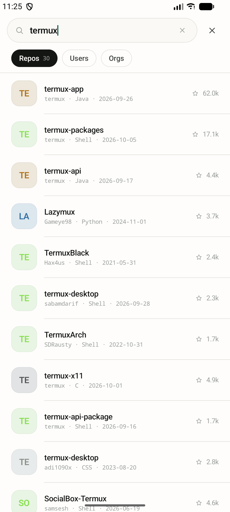
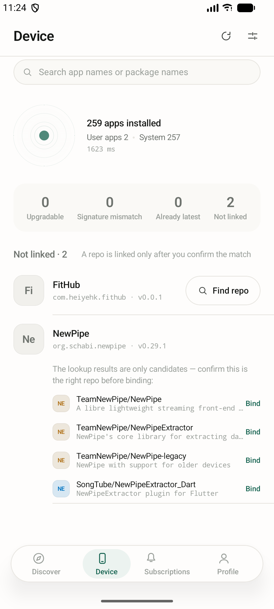
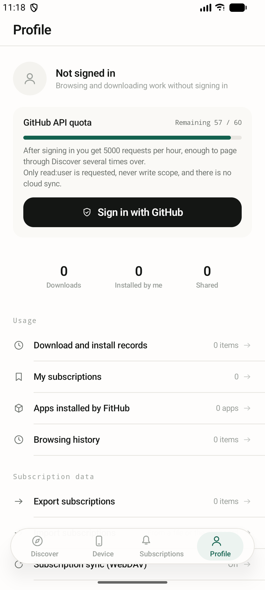

# FitHub

[](LICENSE)
[](https://kotlinlang.org)
[](https://developer.android.com/build)

一个用于发现和安装 GitHub Releases 分发的开源应用的 Android 客户端。

它做两件浏览器标签页做不到的事：

- **挑对安装包。** 一个 release 通常会为不同 ABI 和平台发布多个归档文件。FitHub 逐个读取，并告诉你哪一个适配你手上这台设备。
- **说明本机已装情况。** 它扫描已安装的包，把能匹配上仓库的应用标出来，说明是否有更新、签名是否允许直接覆盖安装。

[English](README.md)

## 截图

| | |
|---|---|
| <br>仓库详情 —— 真实 release 产物，每个都写明适不适配的原因 | <br>本机页 —— 真实 <code>PackageManager</code> 扫描，1.7 秒扫出 259 个包 |
| <br>发现 —— 所有判定的基准都来自这里探测到的本机档案 | <br>搜索 —— 支持 GitHub 筛选语法，结果原样透传 |
| <br>包名反查 —— 只给候选，绑定仍需逐条确认 | <br>我的 —— 配额读 <code>X-RateLimit-Remaining</code>，不是写死的数字 |

## 状态

早期开发中，功能尚不完整。版本 `0.0.5`，以下描述与该版本一致：

| 范围 | 状态 |
|---|---|
| 发现、搜索、用户/组织页、仓库详情 | 可用，真实 GitHub API |
| 搜索历史 | 可用 —— 最近 10 条，可清空，纯本机且不参与同步 |
| 页面导航 | 可用 —— 返回回到**进来的那一页**（搜索结果、用户页、我的项目），而不是直接落回首页 |
| API 配额显示 | 可用，读 `X-RateLimit-Remaining` |
| 已装应用扫描、设备 ABI/SDK 探测 | 可用 |
| Release 产物分类与适配判定 | 可用 |
| 通过 `PackageManager` 解析 APK | 可用，需用户主动触发 |
| README 渲染 | 可用，切到「说明」tab 时才按需拉取 |
| 仓库代码浏览 | 可用 —— README 旁边的文件树 tab。按目录懒加载，目录结果缓存 6 小时、文件正文不缓存。二进制与超大文件转「在 GitHub 上打开」，面包屑每一级可点回退 |
| 无架构信息产物的判定 | 可用 —— 文件名里没写 ABI 的 APK 不再判「无法解析」，而是带说明地作为候选；同档候选里 release 压过 debug / unsigned |
| 包名到仓库的绑定 | 可用 —— 随包分发的 F-Droid 索引命中时零请求，其余走用户确认的候选。FitHub 自己那条绑定是固定的，不可解绑、不可改绑 |
| 订阅 | 可用 —— 列表存本机、导入导出、手动刷新。定时检查与通知尚未接入 |
| WebDAV 订阅同步 | 可用 —— 需主动开启，按 `exportedAt` 判新旧。常见服务商有预设，自建需自行填地址 |
| 首页板块 | 可用 —— 四个内置板块可开关，另可加最多 6 个自定义 topic 板块 |
| 历史足迹 | 可用 —— 纯本机，不参与同步。浏览足迹与下载安装记录共用一份列表；记录在文件真正落盘时才写，不是按下按钮就写 |
| 下载与安装 | 已实现 —— 前台服务 + 通知栏进度，下载时算 SHA-256，交给系统安装器 |
| 登录 | 已跑通真实链路 —— GitHub Device Flow，真机验证过。令牌存进 Android Keystore，只申请 `read:user` |
| 检查更新 | 已实现 —— 按版本号分段比较（不是字符串相等），本机比线上新时如实说明；有新版时给一个按钮直接进本仓库详情页下载安装 |
| 分享 | 已实现 —— 系统分享面板，带仓库、本机适配结论和 Release 链接。是文字，不是图片卡片 |
| 偏好设置 | 已实现 —— 外观（跟随系统/浅色/深色）、是否包含预发布版本、安装前是否强制校验 SHA-256 |

每个 release 都会附上 APK。取 [`FitHub-v0.0.5-release.apk`](https://github.com/heiyehk/FitHub/releases/tag/v0.0.5) —— 已签名、R8 压缩、含全部四种 ABI。想看 logcat 就用 `-debug` 那个。

## 功能

**适配判定。** 每个 release 产物会被判定为四种状态之一，显示在产物行上：

| 判定 | 含义 |
|---|---|
| Match 匹配 | 产物 ABI 在本机支持范围内 |
| Degrade 可降级 | universal 包 —— 能装，但带着本机用不到的架构代码 |
| Mismatch 不匹配 | ABI 不符，或属于桌面端产物。置灰但不隐藏，并写明原因 |
| Unknown 无法解析 | 解析失败。给出原始链接，不做猜测 |

**本机判定。** 对于已匹配到仓库的已装应用：

| 判定 | 含义 |
|---|---|
| Upgrade 可升级 | 本机 `versionCode` 低于 release |
| Latest 已是最新 | 本机 `versionCode` 大于或等于 release |
| SigningConflict 签名冲突 | 两侧证书指纹都已读到且不一致 —— Android 会拒绝覆盖安装 |
| VersionUnknown 版本待确认 | 远端 APK 未解析过，两个 `versionCode` 不可比 |

**不确定被显式表达。** 代码里有三处刻意不使用 `Boolean`：

- `hasInstallable()` 失败时返回 `null`。「请求失败」和「这个仓库没有 release」是两种状态，UI 分别渲染。
- `ScanResult.complete` 记录本次扫描是否被包可见性过滤截断。被截断时 UI 写「能看到 N 个应用」，而不是「共安装 N 个」。
- 签名冲突只在两侧指纹都真的读到时才报。缺一侧时只给版本比较结论，对签名不作任何声明。

## 环境要求

- Android 8.0（API 26）或更高
- JDK 17
- 安装了 API 36 的 Android SDK

## 构建

```bash
./gradlew assembleDebug       # debug APK
./gradlew testDebugUnitTest   # FitEngine 单元测试
./gradlew installDebug
```

Windows PowerShell 下把 `./gradlew` 换成 `.\gradlew.bat`。

产物在 `app/build/outputs/apk/`。

### Release 签名

只有当仓库根目录存在 `keystore.properties`、**且**其中 `storeFile` 指向的文件真实存在时，
`assembleRelease` 才会签名。否则它会静默产出一个装不上的未签名 APK。脚本把两半都做了，
并打印证书指纹：

```bash
pwsh -File scripts/make-release-keystore.ps1
```

口令输入两遍、不回显；传给 `keytool` 时走环境变量，不作为命令行参数。想手动生成：

```bash
keytool -genkeypair -v -keystore app/fithub-release.jks -storetype PKCS12 \
  -alias fithub -keyalg RSA -keysize 4096 -sigalg SHA256withRSA -validity 10000 \
  -dname "CN=FitHub, OU=Open Source, O=FitHub, C=CN"
```

然后复制模板并填写：

```properties
storeFile=app/fithub-release.jks
storePassword=<你设的口令>
keyAlias=fithub
keyPassword=<同一个口令>
```

两个容易踩的点：`storeFile` 相对**仓库根**解析；PKCS12 要求 `storePassword` 与 `keyPassword`
相同。`keystore.properties` 和 `*.jks` 已在 `.gitignore` 中，不要提交。密钥请另做备份 ——
丢了就意味着此后无法给已发布的应用发更新。

从 `v0.0.1` 起，这个已发布的证书就固定下来了。日后换密钥必须与它一致，否则 Android 会拒绝覆盖安装：

```
SHA-256: A4:49:FD:1B:31:E8:94:F8:2E:E5:F6:C6:22:6E:B7:4E:6F:0C:EF:9C:4C:1E:B6:7F:83:D3:40:0B:CE:B9:92:B4
```

`keytool -list -v -keystore app/fithub-release.jks -alias fithub` 在 `SHA256:` 一行打印同样的值，
就说明手上的密钥是对的。

### GitHub client ID

登录界面已经接线；**全新克隆**缺的是 client ID 本身（release 页面上的 APK 已经带上了，构建期烘进去的）。
`app/build.gradle.kts` 会把 `GITHUB_CLIENT_ID` 烘进 `BuildConfig`，而该字段为空时 `LoginScreen` 会直说「没配」，
而不是等到第一次请求才失败。这个值在配置期读取，按下面的顺序取第一个「已设置且非空」的来源：

| 来源 | 谁在用 |
|---|---|
| 环境变量 `FITHUB_CLIENT_ID` | CI，以及你自己的 shell |
| gradle 属性 `fithub.githubClientId` | `~/.gradle/gradle.properties`，这样它就不进仓库 |
| 都没有 | 取 `""`，构建照常成功 |

所以全新 clone 不需要任何配置就能出包。想产出真正能登录的 APK，先在
*Settings → Developer settings → OAuth Apps* 注册一个 OAuth App 并**勾上 Enable Device Flow**，然后：

```bash
export FITHUB_CLIENT_ID=xxxxxxxxxxxxxxxxxxxx    # bash
./gradlew assembleDebug
```

```powershell
$env:FITHUB_CLIENT_ID = 'xxxxxxxxxxxxxxxxxxxx'  # PowerShell
.\gradlew.bat assembleDebug
```

它不是秘密 —— Device Flow 连 `client_secret` 都不用，而且这个值本来就明文躺在你发布的每个
APK 里。不把它放进仓库，是为了让「仿冒本 App 授权页」这件事没有现成可抄的素材，也让每个 clone
的人填自己的。值里混进意外字符时，构建期会打一条 `[fithub]` 告警但**不会失败** —— 一个配错的
client_id 不该有能力把无关的构建搞挂。

### CI

`.github/workflows/android.yml` 在每次 push 和 pull request 上运行，`v*` tag 也会触发。

它会跑单元测试，然后构建并上传 debug 与 release 两个 APK。打到 tag 时还会创建 GitHub Release
并附上 APK。构建脚本没有为 CI 做任何改动 —— `app/build.gradle.kts` 本来就会读
`keystore.properties`，workflow 只要把密钥还原成那个文件即可。

**除非**你在 *Settings → Secrets and variables → Actions* 里配置了下面几个仓库密钥，
否则 release APK 是未签名的：

| 密钥 | 取值 |
|---|---|
| `KEYSTORE_BASE64` | `base64 -w0 app/fithub-release.jks`（Linux/macOS）；Windows 用 `certutil -encode app/fithub-release.jks keystore.b64` 后去掉首尾行 |
| `STORE_PASSWORD` | keystore 密码 |
| `KEY_ALIAS` | 密钥别名，例如 `fithub` |
| `KEY_PASSWORD` | 密钥密码 |

没配的话 release APK 照样会构建并发布，只是没有签名 —— job 只打印一条提示而不会失败，
这样 fork（读不到你的密钥）也能把整条流水线跑通。

还有一个可选**变量** `FITHUB_CLIENT_ID`，通过 job 的 `env` 传入，被 `app/build.gradle.kts` 当作
普通的构建期值读取。它放 variable 而不是 secret，因为它本来就不是秘密：Device Flow 连
`client_secret` 都不需要，这个值就明文躺在你发布的每一个 APK 里；而 secret 会在日志里被替换成
`***`，连 `Build succeeded` 这句里恰好撞上的正常输出也一起被打码，排查时只剩一堆无意义的星号 ——
拿一个非敏感的构建期值去换日志可读性不划算。不配它只是意味着发布出去的 APK 不能登录，其他一切不变，
gradle 属性的回退机会仍然会被保留。

注意两者是两套独立的读接口：`${{ vars.X }}` 读不到 secret，`${{ secrets.X }}` 也读不到 variable，
同名也不会互相回退。另外**不要**把 `KEYSTORE_BASE64` 和那几项口令挪到 variable —— 那些是真秘密，
而 variable 在构建输出里不做脱敏。

## 架构

单模块，两层结构，不用 DI 框架，不用导航库。

```
data/
  FitEngine.kt        适配 + 本机判定（纯函数，不依赖 Android API）
  Env.kt              进程级可变状态：本机档案、日期、格式化函数
  ScanEngine.kt       PackageManager 扫描
  LinkEngine.kt       包名 -> 仓库绑定
  FitRepository.kt    UI 唯一数据入口，Async<T> 三态
  HistoryStore.kt     浏览足迹与下载记录
  Prefs.kt            用户偏好，落在 SharedPreferences
  TokenStore.kt       OAuth 令牌存进 Android Keystore
  remote/             Ktor 客户端、DTO、DTO->领域模型映射、文件缓存
    ReleasePick.kt    「最新版」的选取规则（草稿出局，预发布由偏好开关控制）
  parse/ApkParser.kt  下载 + PackageManager 清单解析
  install/            DownloadService（前台进度）+ ApkInstaller（PackageInstaller）
ui/
  FitHubApp.kt        状态持有者，单 Activity + overlay 导航
  theme/              配色、字号、动效令牌
  icons/Icons.kt      手写 ImageVector
  */                  每个页面一个文件
```

`Env` 是进程级全局可变状态而非依赖注入。对当前这个体量是有意为之，也是项目继续变大时最该先动的地方。

改动之前有两点需要先知道：

**本机档案是所有判定的基准。** `DeviceProfile.detect()` 读 `Build.SUPPORTED_ABIS` 和 `Build.VERSION.SDK_INT`，App 内所有架构与版本结论都基于它计算。它来自真机探测，不使用任何固定值。

**未登录配额是 60 次/小时。** 请求预算是显式约定的：发现页每段 1 次、仓库详情 2 次、搜索 1 次、用户页 2 次。FitHub 不会为了给列表每行填适配徽标就逐个拉 release —— 30 行的列表会直接打光配额。适配结论只在详情页按需计算，README 也只在点开「说明」tab 时才拉，不随详情一起请求。

**缓存数据必须标注。** 接口响应带 `fromCache` 与 `ageMs`，UI 据实说明。缺了这两个字段，用户分不清「3 个 star 是刚拿到的」还是「2 小时前的」，那和把查询失败说成「没有 release」是同一类错误。缓存即使超过 TTL 也不会被直接丢弃 —— 离线时给出旧数据，好过什么都不显示。

## 国际化

英文与简体中文两种。**英文是默认资源，中文是翻译**：

| 系统语言 | 显示 |
|---|---|
| 英文 | 英文 |
| 中文 | 中文 |
| 其他语种 | 英文（回退到 `values/`） |

另外有 App 内覆盖 —— 「我的 → 语言」，三选一：**跟随系统 / 简体中文 / English**。它不只是一个
「下次启动生效」的开关：Android 13 及以上，这个选择会出现在系统设置的应用语言列表里。

实现上有两件事值得先知道再动字符串。

**语言代码在两个不同的地方生效，而且它们不能同时起作用。** API 33 及以上，`AppLocale` 写的是
`android.app.LocaleManager.applicationLocales` —— 平台原生的 per-app language 能力，由系统负责
应用，设置里也能看到。API 33 以下没有这个能力，所以由 `MainActivity.attachBaseContext` 自己包装
context，切换后 `recreate()` 生效。如果 API 33+ 上还继续包装 context，用户**从系统设置**改的语言
会被 App 内的旧偏好盖回去。`AppLocale.wrap()` 在系统已经设了 locale 时原样返回 context，
这就是让两者不打架的关键。

另一个显而易见的选择是 `androidx.appcompat` 的 `AppCompatDelegate.setApplicationLocales()`，
这里刻意不用：它要求 Activity 继承 `AppCompatActivity`、主题继承 AppCompat 主题，而本项目的
主题 parent 是平台主题 `@android:style/Theme.Material.Light.NoActionBar`。为一次语言切换把
Material Components 拖进来不划算，平台 API 用零依赖覆盖了同样的需求。

**领域层持有的是资源 ID，不是字符串。** `data/` 层没有 `Context`，而 `FitEngine` 是要跑在 JVM
单元测试上的纯函数，不能调 `getString`。所以它返回 `Explain` —— 一个 `@StringRes` 加上它的
格式化参数，由 UI 层渲染：

```kotlin
Explain(R.string.reason_abi_mismatch, listOf(device.abi, abi))
```

```kotlin
Text(explainText(asset.reason!!))   // 在 @Composable 里
context.getString(...)               // 以及在普通函数里，比如分享面板
```

这也是 `Asset.reason` 是 `Explain` 而不是 `String` 的原因。相应地，适配判定的测试断言的是
**选了哪条资源**，而不是「中文文案里有没有某个字」—— 后者会在措辞一改、一翻译就变红。

### 新增一种语言

1. 建 `res/values-<语言代码>/strings.xml`，key 与 `res/values/strings.xml` 保持一致
2. 完事。不需要在代码里注册什么

### 不漏译

`./gradlew :app:verifyTranslations` 解析两个文件，key 集合不一致、或者某个 `%1$s` 占位符在一
种语言里缺失或序号错位，都会直接让构建失败。它挂在 `preBuild` 上，每次 `assembleDebug` 都会跑。
这取代了 lint 的 `MissingTranslation` —— 本项目关掉了 `checkReleaseBuilds`（见「已知限制」），
lint 那条门禁本来就不生效；而它对占位符的检查更严：漏掉一个 `%1$s` 运行时只会显示成字面量
`%1$s`，任何编译器都不会报错。

## 测试

```bash
./gradlew testDebugUnitTest
```

`app/src/test/java/com/heiyehk/fithub/data/` 下共 131 个 JVM 单元测试。之所以放在 JVM 而不是设备上跑，是因为开发期间手边只有 x86_64 模拟器，arm64 分支在设备上永远执行不到。如果你的 CI 有 arm64 环境，这个缺口值得补上。

| 文件 | 覆盖 |
|---|---|
| `FitEngineTest.kt` | 经 `GitHubMapper` 的适配与本机判定 —— 实际会跑到的代码路径 |
| `RepoCacheTest.kt` | 缓存 TTL 行为，以及过期缓存在离线路径上仍可读 |
| `ReadmeTest.kt` | readme 接口的 base64 解码，以及 512 KB 截断标记 |
| `LocalStoreTest.kt` | filesDir 持久化：内容损坏退回默认值而非抛错、原子写 |
| `SubscriptionTest.kt` | 快照时效、排序，以及 `Repo` → `Subscription` 的转换 |
| `SubscriptionTransferTest.kt` | 导入导出：合并语义、版本拒绝、路径穿越防护 |
| `SubscriptionSyncTest.kt` | WebDAV：`exportedAt` 在损坏/空文件下的解析、按时间判新旧、服务商预设、启用条件 |
| `HistoryEntryTest.kt` | 足迹去重键、排序、环形上限 |
| `HomeSectionTest.kt` | 首页板块配置：内置板块不可改、id 派生、自定义上限 6 个、排序 |
| `DeviceFlowTest.kt` | 设备码登录：未配置与失败的区别、用户拒绝、码过期、`slow_down`，以及默认 scope 只含 `read:user` |
| `ReleasePickTest.kt` | 「最新版」选取：预发布不得被当成最新版，草稿永远排除，以及「只发过预发布」与「什么都没发」必须可区分 |

判定类测试重点覆盖：

- x86_64 设备上 arm64 产物不得判为 `Match`
- 未解析的 release 带来 `versionCode == 0`，必须得到 `VersionUnknown` 而非 `Latest`
- 报签名冲突要求两侧指纹都存在，单侧数据不得报错
- 校验文件（`SHA256SUMS.txt`、`*_sha256sums`、`*.asc`）不是可安装产物
- DTO 的 snake_case 字段确实映射上了

## 已知限制

- 开发期间没有真机。帧率、真机应用数量、商店渠道签名冲突均未测试。上述结论均基于 x86_64 模拟器加 JVM 单元测试得出。
- **登录已在真机跑通完整链路。** 设备码、浏览器授权、轮询换令牌、60→5000/h 的配额切换都验证过；令牌落在 Android Keystore。仍未验证的是**私有仓库**那条链路 —— 代码接线了，但没有真实私有仓库可测。
- 发现页缓存 1 小时，仓库详情 6 小时。刷新按钮会先作废缓存再请求，所以一定走网络。目前没有后台定时刷新，缓存内容只在下拉刷新或某个页面未命中缓存时才会更新。
- 包名反查先查随包分发的 F-Droid 索引（3698 条映射，零请求）；查不到的才按包名搜候选，仍只在仓库名 / README 里出现过包名的项目找得到，需要手动绑定。
- 滚动中点击卡片时，详情转场起点取的是点击瞬间的坐标，快速滑动会有轻微落点偏差。可改用 `LazyListState` 反查可见项。
- `app/build.gradle.kts` 里关掉了 `checkReleaseBuilds`：AGP 9.1.0 的 `lintVitalAnalyzeRelease` 在分析 Compose 源码时自身崩溃。`./gradlew lint` 仍可正常使用。
- 详情转场是单 Activity 内的 overlay，不是 NavHost，系统返回由 `BackHandler` 处理。

## 设计说明

纯白底、发丝线分隔、单一墨绿强调色，无渐变、无卡片嵌套。颜色只用于表达状态，不用于表达层级。版本号、体积、校验和统一用等宽字体，避免数字宽度变化导致抖动。

动效只跑 `transform`、`alpha` 和 `color`，不跑 layout 动画。详情面板与内容层缩小共用同一个 `Animatable(0f)`，因此中途反向点击能连续衔接。

## 参与贡献

欢迎提 issue 和 PR。提交前有两点：

- `FitEngine` 的判定逻辑有单元测试覆盖。改动判定逻辑时，请同步改测试或加测试。
- 保持「不确定」可表达。任何语义为「查不到」的新布尔值，都应该是三态。

## 文档

- [产品概述](docs/产品概述.md) · [Product scope](docs/product-scope.md) —— 产品定位、各模块实现状态、设计令牌，以及这个 App 必须处理对的问题
- `docs/screens/` —— 截图

## 许可证

[MIT](LICENSE) © 2026 heiyehk
